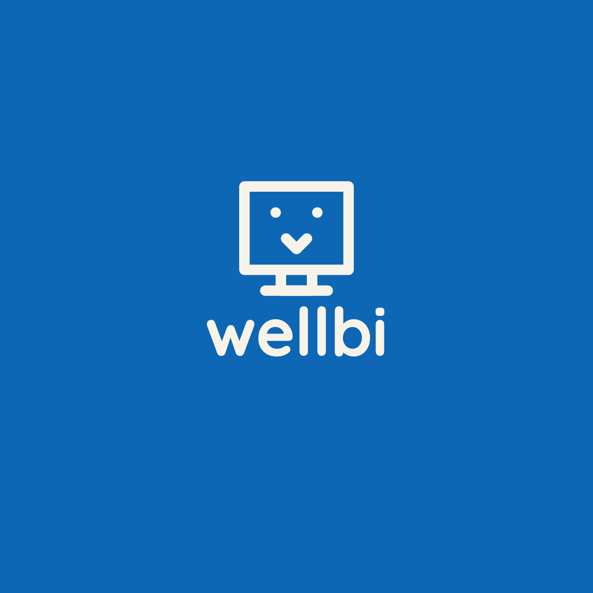
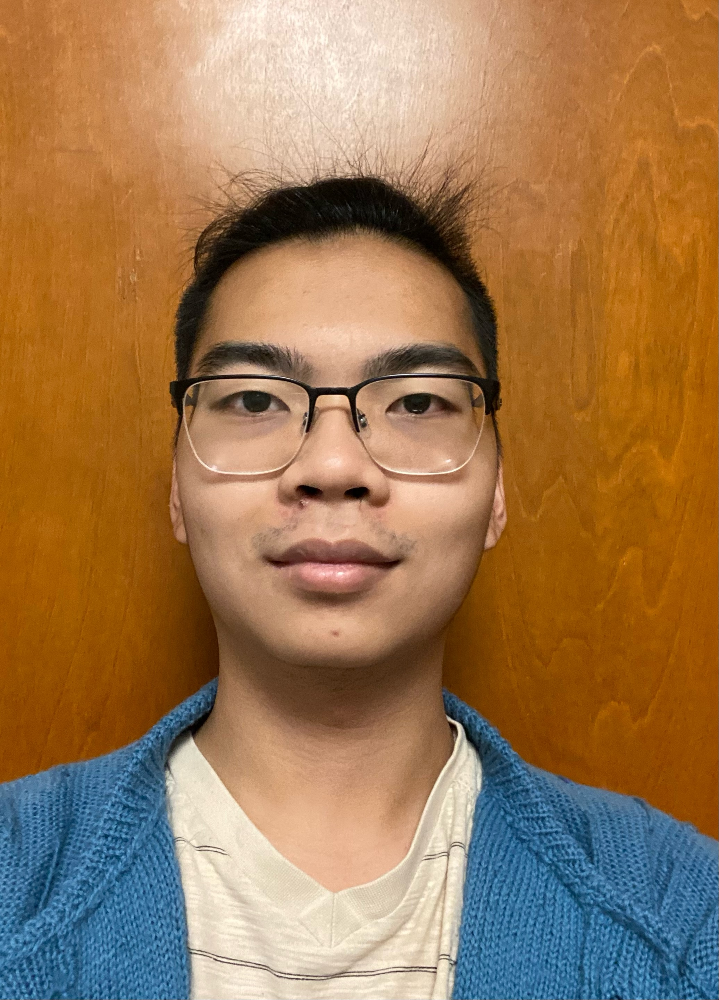
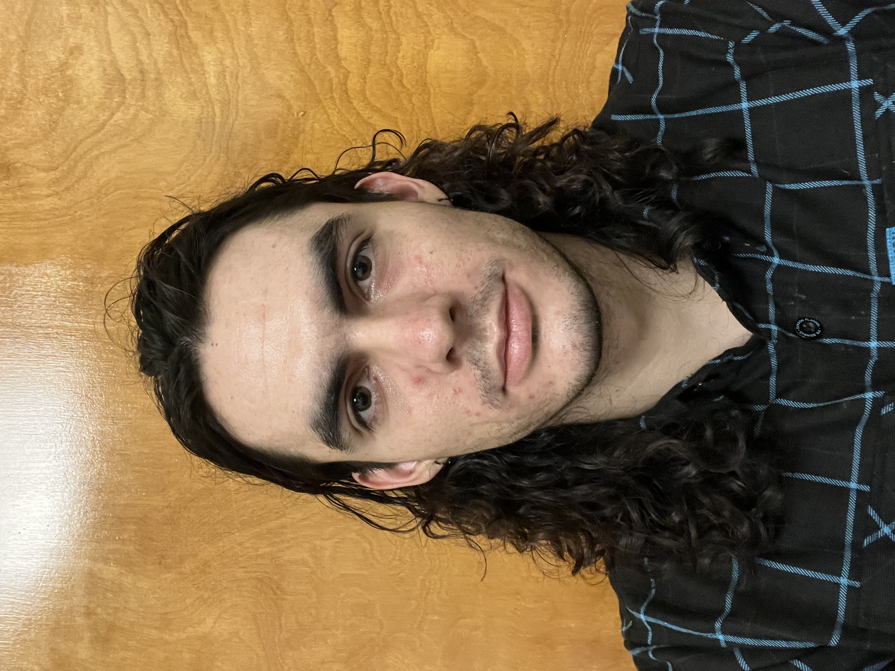

# Wellbi

## Team

Nathaniel Chien

Ethan Garrity

Ryan Kirk

Nandini Naidu

Tiffany Shi

## Synopsis

Wellbi is a Sexual and Mental Health support bot. Using NLP/CV we want users to be able to ask Wellbi any question they have about their sexual or mental health. Wellbi will use NLP to create preliminary diagnoses and recommend potential treatments or further care. Wellbi also seeks to provide a community-based method of support, guidance, and treatment by providing anonymous chat rooms for users that have the same symptoms or conditions. In addition, Wellbi will provide information about the nearest free clinics and redirect users to professional physicians based on symptom severity. Wellbi is the first step in receiving physical and emotional support when dealing with sexual and mental health issues.

## Contact
thshi@stanford.edu \
egarrity@stanford.edu \
nnaidu@stanford.edu \
rkirk10@stanford.edu \
nchien2@stanford.edu

## Team Matrix

https://docs.google.com/document/d/1xXoGuB7Q3TaHP-GhRnFV7zLkegfDRG7v2s_8tc05rcA/edit?usp=sharing
